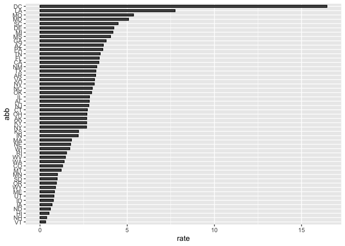

Report on Gun Murders
================
Abraham Kudiabor
2023-07-09

``` r
library(tidyverse)
```

    ## ── Attaching core tidyverse packages ──────────────────────── tidyverse 2.0.0 ──
    ## ✔ dplyr     1.1.2     ✔ readr     2.1.4
    ## ✔ forcats   1.0.0     ✔ stringr   1.5.0
    ## ✔ ggplot2   3.4.2     ✔ tibble    3.2.1
    ## ✔ lubridate 1.9.2     ✔ tidyr     1.3.0
    ## ✔ purrr     1.0.1     
    ## ── Conflicts ────────────────────────────────────────── tidyverse_conflicts() ──
    ## ✖ dplyr::filter() masks stats::filter()
    ## ✖ dplyr::lag()    masks stats::lag()
    ## ℹ Use the conflicted package (<http://conflicted.r-lib.org/>) to force all conflicts to become errors

``` r
load("R_Data/Murders.rda")
```

## R Markdown

This is an R Markdown document. Markdown is a simple formatting syntax
for authoring HTML, PDF, and MS Word documents. For more details on
using R Markdown see <http://rmarkdown.rstudio.com>.

When you click the **Knit** button a document will be generated that
includes both content as well as the output of any embedded R code
chunks within the document. You can embed an R code chunk like this:

## Including Plots

You can also embed plots, for example:

``` r
Murders %>% mutate(abb = reorder(abb, rate)) %>%
  ggplot(aes(abb, rate))+
  geom_bar(width = 0.5, color = "black", stat = "identity")+
  coord_flip()
```

<!-- -->

``` r
ggsave("Figures/Murders Barplot.png")
```

    ## Saving 7 x 5 in image

Note that the `echo = FALSE` parameter was added to the code chunk to
prevent printing of the R code that generated the plot.
